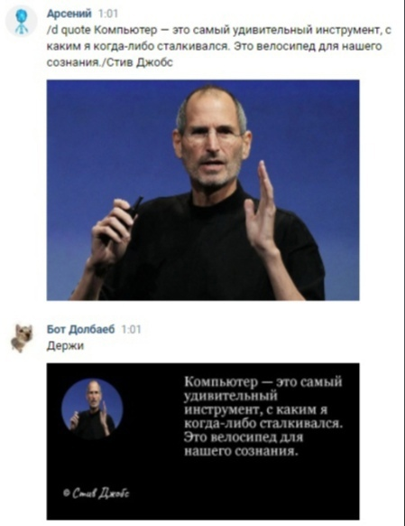
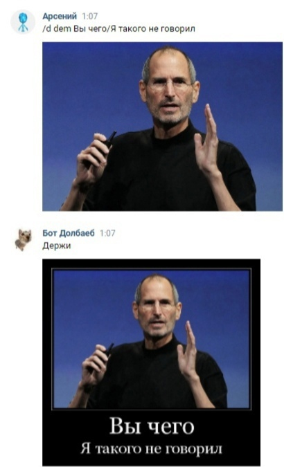
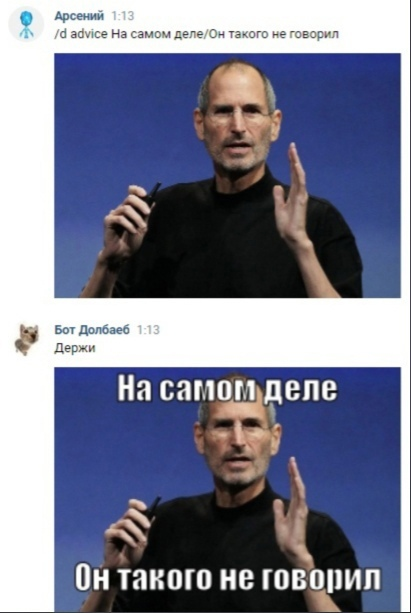
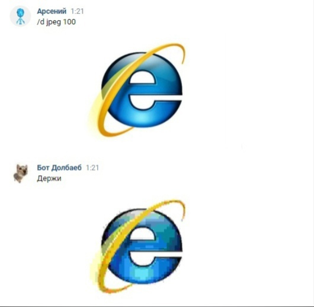
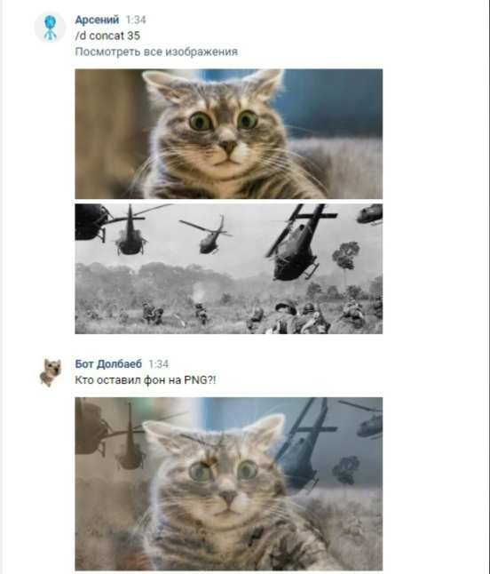
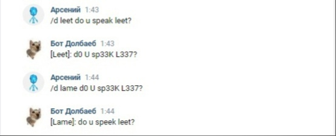

# **Как пользоваться ботом?**
В этой статье содержатся инструкция о том, как пользоваться ботом.
Будут подробно описаны все его команды и функционал.

## **Что умеет бот?**
Главное умение бота — его обучаемость сообщениям в беседах.
Он может запоминать логическую связку сообщений и затем отвечать на что-то похожее!

### **Так же к этому относится:**

 * Дополнение уже имеющихся узлов (логических связок) новыми, то есть объединение
 нескольких похожих в одно. Это схоже с приведением к общему знаменателю в математике.
 * Обучение ответам на вложения по их типам: фотографиям, видео, стикерам и так далее
Бот с некоторым шансом отвечает на сообщения, похожие на уже изученные

# Команды бота
Для того, чтобы избежать путаницы в беседах с большим кол-вом ботов, команды конкретно нашего начинаются с **«/d»** или **«/д»**.

Корректные варианты обращения:

* **/d *<команда>*** — через слеш
* **!d *<команда>*** — через восклицательный знак
* Можно обратиться по нику **@bot.dolbaeb**.
Например: **@bot.dolbaeb /d *<команда>***
* Можно использовать кириллицу в написании:
**/d *<команда>*** и **/д *<команда>*** эквиваленты

Большинство команд имеют свой аналог на кириллице, но об это ниже.

Ниже приведен список всех команд с подробным описанием и примерами

# Передовые команды
**/d** — сгенерировать случайное предложение

**/d help** — краткая помощь по командам

**/d stat** — различная статистика бота

# Обработка изображений
Команды из раздела **«Обработка изображений»** своим обязательным параметром принимают любую **фотографию**.
То есть вам нужно либо прикрепить к сообщению фотографию, либо переслать/ответить на сообщение, где таковая имеется. Среди них бот выберет первые подходящие и использует по назначению команды.

***

**/d quote *<текст>/<автор>***— создать «Цитату великого человека»

Аналог: **/д цитата**

* Обложкой цитаты будет либо первая найденная фотография в сообщении, либо картинка профиля автора.
* Текстом будет либо текст, указанный в команде, либо ближайший текст среди пересланных сообщений.
* Автором будет либо автор, указанный в команде, либо автор ближайшего пересланного сообщения.

    

***

**/d demotivator *<верхний текст>/<нижний текст>*** — создать демотиватор

Аналог: **/д демотиватор**

    

***

**/d advice *<текст сверху>/<текст снизу>**** — создать эдвайс-мем

Аналог: /д эдвайс

    

***

**/d jpeg *<степень>*** — «сшакалить» картинку

Аналог: **/д джипег**

Параметр <степень> отвечает за степень понижения качества от 0 до 100.
По умолчанию равен 94, эффект заметен при степени >65.

    

***

**/d concat *<степень>*** — конкатенировать изображения 🤨

Аналог: **/д конкат**

Накладывает от 2 до 4 изображений друг на друга
Используйте параметр <степень>, для изменение прозрачности накладываемых изображений (число от 0 до 100, 70 по умолчанию)

(Сомнительная функция, может вырезать? 😥)

    

# Прочие команды
**/d aud *<текст>*** — озвучить ваш текст

**/d weather *<город>*** — погода в каком-то городе
Аналог: /д погода

***

**/d wiki *<запрос>*** — получить краткую сводку по запросу с вики

Так же вы можете написать что-то вроде «Что такое <запрос>»

***

**/d joke** — бот скинет анекдот

Аналог: /д анекдот

***

**/d leet *<текст>*** и **/d lame *<leet текст>***

Перевести текст в Leet Speek и обратно (английский)

    

***

**/d math *<пример>*** — решить арифметический пример